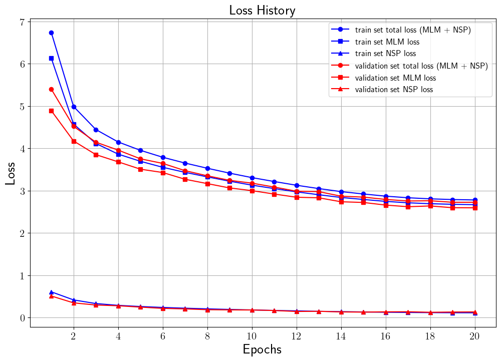
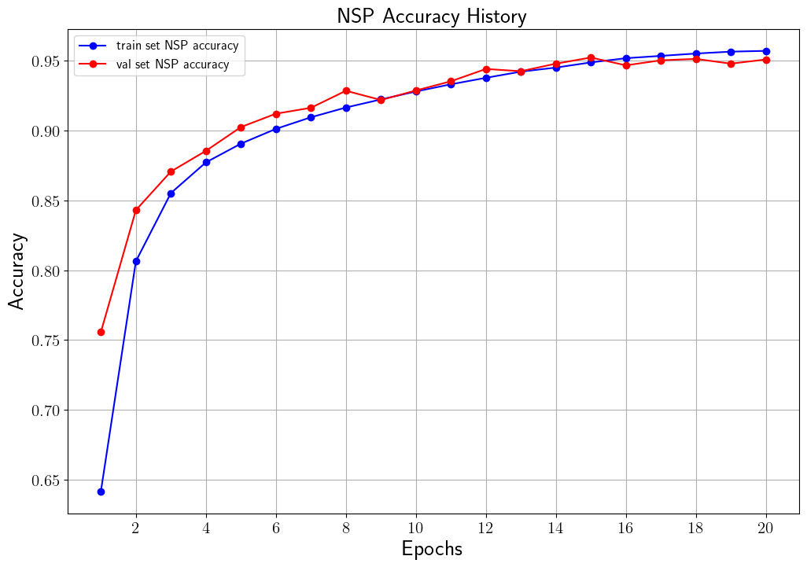

# BERT Pre-training
## 설명
[WikiSplit](https://github.com/google-research-datasets/wiki-split)의 문장 쌍 데이터를 사용하여 [BERT](https://arxiv.org/pdf/1810.04805.pdf) 모델 pre-training을 수행합니다.
BERT pre-training에 대한 설명은 [WikiSplit을 이용한 BERT Pre-training](https://ljm565.github.io/contents/bert2.html)을 참고하시기 바랍니다.
본 코드는 Next Sentence Prediction (NSP), Masked Language Modeling (MLM)을 이용하여 pre-training을 수행합니다.
<br><br><br>

## 모델 종류
* ### BERT
    [WikiSplit](https://github.com/google-research-datasets/wiki-split)의 문장 쌍 데이터를 사용하여 [BERT](https://arxiv.org/pdf/1810.04805.pdf) 모델 pre-training을 수행합니다.
<br><br><br>


## 토크나이저 종류
* ### Wordpiece Tokenizer
    Likelihood 기반으로 BPE를 수행한 subword 토크나이저를 사용합니다.
    학습을 한 번 실행 시킨 후, 토크나이저가 없다는 메시지를 뱉을 시 wordpiece 토크나이저의 vocab 파일을 모델 학습 전에 아래 명령어를 이용하여 먼저 제작해야합니다. 제작할 vocab의 크기는 src/tokenizer/make_vocab.sh에서 수정할 수 있습니다(Default: 30,000).
    
    ```
    cd src/tokenizer
    bash ./make_vocab.sh
    ```
<br><br>

## 사용 데이터
여기서 나와있는 data_sample은 전체 데이터가 아닌 일부 sample 데이터입니다. 전체 데이터는 아래 링크에서 받을 수 있습니다.
만약 코드가 돌아가는지 확인하기 위해서는 아래 명령어를 먼저 실행해서 데이터 폴더 이름을 변경해야합니다.

```
mv data_sample data
```
* ### WikiSplit
    [WikiSplit](https://github.com/google-research-datasets/wiki-split) 데이터를 사용.
<br><br><br>


## 사용 방법
* ### 학습 방법
    **코드 테스트를 해보기 전, 먼저 데이터 폴더 이름을 위의 '사용 데이터' 부분에 설명한 것 처럼 바꿔줘야 합니다.**
    바꿔준 후, 학습을 시작하기 위한 argument는 4가지가 있습니다.<br>
    * [-d --device] {cpu, gpu}, **필수**: 학습을 cpu, gpu로 할건지 정하는 인자입니다.
    * [-m --mode] {train, test}, **필수**: 학습을 시작하려면 train, 학습된 모델을 가지고 있어서 학습 최종 결과를 보고싶은 경우에는 test로 설정해야합니다. test 모드를 사용할 경우, [-n, --name] 인자가 **필수**입니다.
    * [-c --cont] {1}, **선택**: 학습이 중간에 종료가 된 경우 다시 저장된 모델의 체크포인트 부분부터 학습을 시작할 수 있습니다. 이 인자를 사용할 경우 -m train 이어야 합니다. 
    * [-n --name] {name}, **선택**: 이 인자는 -c 1 혹은 -m {test} 경우 사용합니다.
    중간에 다시 불러서 학습을 할 경우 모델의 이름을 입력하고, test를 할 경우에도 실험할 모델의 이름을 입력해주어야 합니다(최초 학습시 src/config.json에서 정한 모델의 이름의 폴더가 형성되고 그 폴더 내부에 모델 및 모델 파라미터가 json 파일로 형성 됩니다).<br><br>

    터미널 명령어 예시<br>
    * 최초 학습 시
        ```
        python3 src/main.py -d cpu -m train
        ```
    * 중간에 중단 된 모델 이어서 학습 시
        <br>주의사항: config.json을 수정해야하는 일이 발생 한다면 base_path/src/config.json이 아닌, base_path/src/model/{model_name}/{model_name}.json 파일을 수정해야 합니다.
        ```
        python3 src/main.py -d gpu -m train -c 1 -n {model_name}
        ```
    * 최종 학습 된 모델의 test set에 대한 결과를 확인할 시
        <br>주의사항: config.json을 수정해야하는 일이 발생 한다면 base_path/src/config.json이 아닌, base_path/src/model/{model_name}/{model_name}.json 파일을 수정해야 수정사항이 반영됩니다.
        ```
        python3 src/main.py -d cpu -m test -n {model_name}
        ```
    <br><br>

* ### 모델 학습 조건 설정 (config.json)
    **주의사항: 최초 학습 시 config.json이 사용되며, 이미 한 번 학습을 한 모델에 대하여 parameter를 바꾸고싶다면 base_path/src/model/{model_name}/{model_name}.json 파일을 수정해야 합니다.**
    * base_path: 학습 관련 파일이 저장될 위치.
    * model_name: 학습 모델이 저장될 파일 이름 설정. 모델은 base_path/src/model/{model_name}/{model_name}.pt 로 저장.
    * loss_data_name: 학습 시 발생한 loss data를 저장하기 위한 이름 설정. base_path/src/loss/{loss_data_name}.pkl 파일로 저장. 내부에 중단된 학습을 다시 시작할 때, 학습 과정에 발생한 loss 데이터를 그릴 때 등 필요한 데이터를 dictionary 형태로 저장.
    * vocab_size: WikiSplit 학습 시 제작된 vocab 파일들 중 원하는 vocab size 선택. 만약 vocab_size를 10,000으로 설정 했을 시, data/wiki-split/tokenizer 폴더 내에 vocab_10000이라는 이름의 학습된 폴더 있어야함.
    * max_len: 토큰화 된 문장 최대 길이.
    * hidden_dim: BERT 모델의 hidden dimension.
    * ffn_dim: BERT 모델의 feed forward network의 hidden dimension.
    * num_layers: BERT의 레이어 수.
    * num_head: BERT attention head 수.
    * bias: {0, 1} 중 선택. 1이면 모델이 bias를 사용.
    * dropout: 모델의 dropout 비율.
    * layernorm_eps: Layer normalization epsilon 값.
    * batch_size: batch size 지정.
    * epochs: 학습 epoch 설정.
    * lr: learning rate 지정.
    * early_stop_criterion: Validation set의 최소 loss를 내어준 학습 epoch 대비, 설정된 숫자만큼 epoch이 지나도 나아지지 않을 경우 학습 조기 종료.
    <br><br><br>


## 결과
* ### 학습 결과
    * Loss History<br>
    <br><br>

    * Accuracy History<br>
    <br><br>
    
    아래 결과는 validation set의 가장 낮은 loss를 달성했을 때 모델의 test set 결과입니다.
    학습 시간이 오래 걸리다보니 20 epoch만을 실험하였지만, 계속해서 loss가 낮아지고 있었습니다.

    * NSP Accuracy: 0.9518
    * MLM Loss: 2.6205

<br><br><br>
